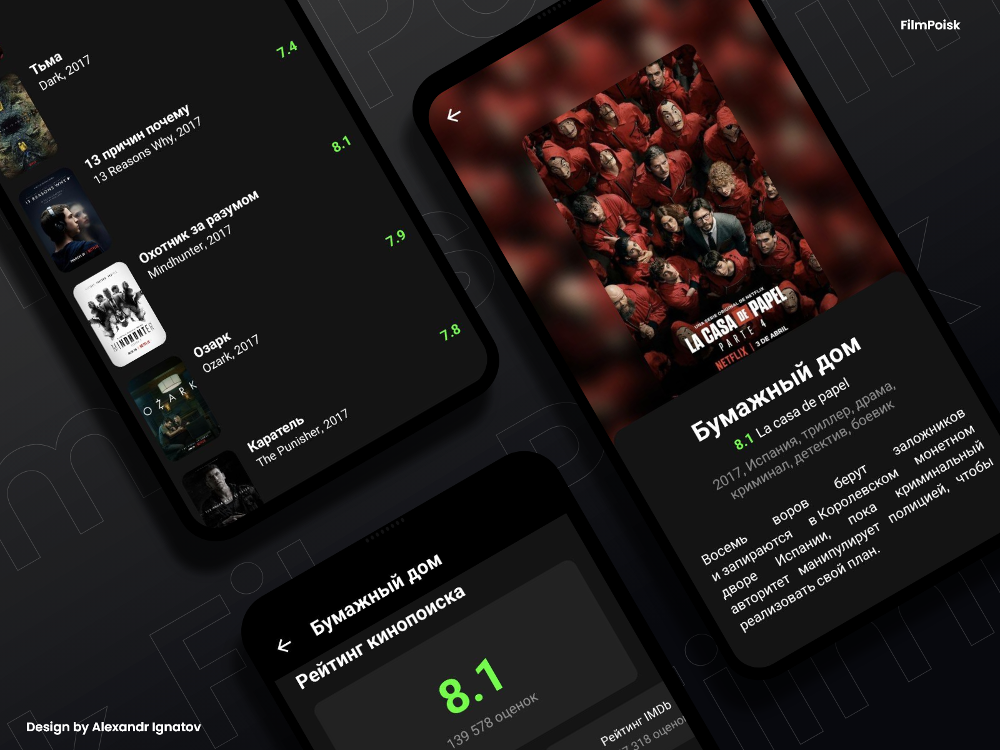
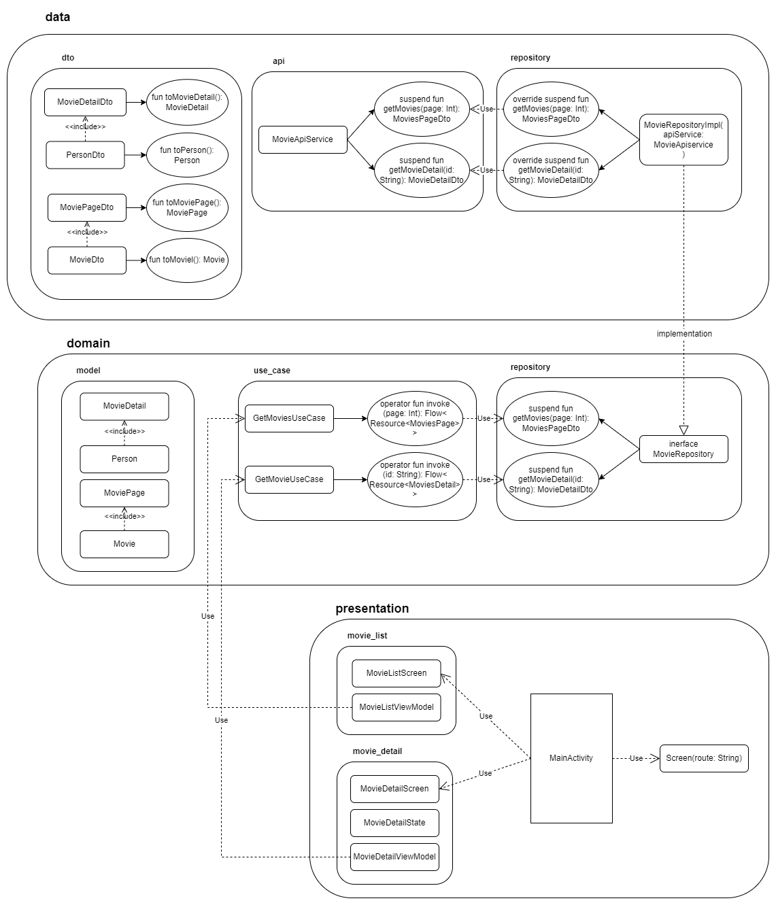

# FilmPoisk

A mobile application for interacting with the fake Kinopoisk API. The application consists of a screen with a list of TV series for 2017-2020 and a screen with detailed information about the selected movie.
> API Information https://kinopoisk.dev/
> To get a personal token [https://t.me/mdwit](https://t.me/mdwit)

## Technologies Used

- Kotlin
- Jetpack Compose
- Retrofit 2
- OkHttp 3
- Paging 3
- Coil
- Hilt
- Coroutines
- Kotlin Flows

## Application Diagram
> The application uses a Clean Architecture & (MVVM pattern to save the screen state)

